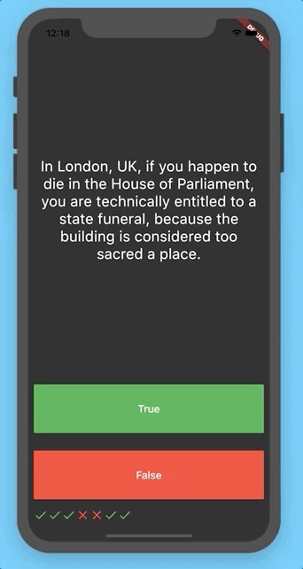

# Quizzler - A Quiz App :star: :fork_and_knife: :heart: :warning:

## Check your skills and answer the questions

## App UI

A new Flutter project.

## Getting Started

This project is a starting point for a Flutter application.

A few resources to get you started if this is your first Flutter project:
- [Lab: Write your first Flutter app](https://flutter.dev/docs/get-started/codelab)
- [Cookbook: Useful Flutter samples](https://flutter.dev/docs/cookbook)

For help getting started with Flutter, view our [online documentation](https://flutter.dev/docs), which offers tutorials, samples, guidance on mobile development, and a full API reference.

## Repository Link

You can find the source code for this project on GitHub: [Quizzler GitHub Repository](https://github.com/yourusername/quizzler.git)
